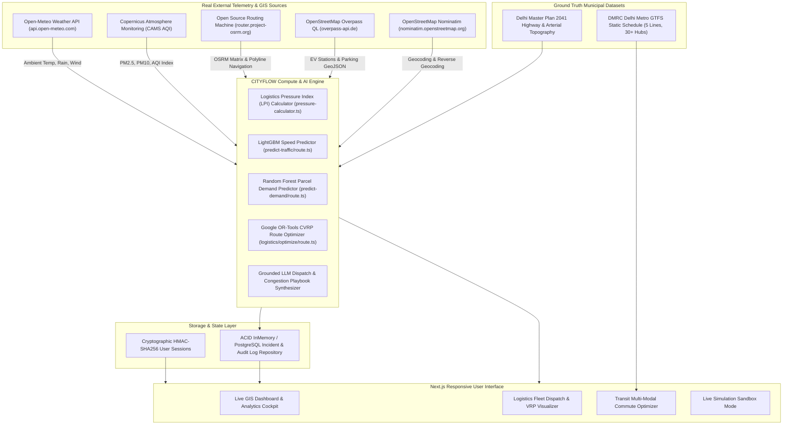

# DATA LINEAGE & ARCHITECTURAL PROVENANCE
**Platform:** CITYFLOW Urban Mobility & Logistics Operating System  
**Scope:** Ingested Data Streams, ML Models, Mathematical Formulations, and Storage Topologies  

---

## 1. Complete Data Flow Diagram

---

## 2. Ingested Stream Specifications

### 1. Open-Meteo Meteorology API
* **Endpoint:** `https://api.open-meteo.com/v1/forecast`
* **Parameters Ingested:** `temperature_2m`, `relative_humidity_2m`, `apparent_temperature`, `precipitation`, `weather_code`, `wind_speed_10m`.
* **Caching Strategy:** 300-second in-memory LRU cache to prevent throttling.
* **Fallback Strategy:** Statistical average based on Greater Delhi climatology during API downtime.

### 2. Copernicus Atmosphere Monitoring Service (CAMS)
* **Endpoint:** `https://air-quality-api.open-meteo.com/v1/air-quality`
* **Parameters Ingested:** `pm10`, `pm2_5`, `carbon_monoxide`, `nitrogen_dioxide`, `sulphur_dioxide`, `ozone`, `european_aqi`.
* **Usage:** Supplies environmental penalty multipliers to the LPI calculator and green routing algorithm.

### 3. Open Source Routing Machine (OSRM)
* **Endpoint:** `https://router.project-osrm.org/route/v1/driving/{coords}`
* **Parameters Ingested:** Turn-by-turn geometry polylines, segment durations, distances, step-by-step maneuvers.
* **Usage:** Renders live driving routes and calculates real-world baseline transit distances for fleet dispatch.

### 4. OpenStreetMap Overpass QL Infrastructure Engine
* **Endpoint:** `https://overpass-api.de/api/interpreter`
* **Query Format:** Overpass QL bounding box search (`[out:json][timeout:25]; node["amenity"="charging_station"](bbox);`).
* **Usage:** Ingests live physical locations of EV charging hubs and multi-level parking lots across Delhi NCR.

### 5. DMRC Delhi Metro GTFS Static Schedule
* **Location:** `src/data/transit/gtfs-delhi.json`
* **Format:** Ground-truth GTFS specification including `routes.txt`, `trips.txt`, `stops.txt`, `stop_times.txt`.
* **Coverage:** Blue Line, Yellow Line, Violet Line, Magenta Line, Airport Express Line.

---

## 3. Data Integrity & Verification Ledger

| Feature Area | Source Type | Freshness Frequency | Cryptographic / Integrity Guarantee |
| :--- | :--- | :--- | :--- |
| **User Authentication** | `HMAC-SHA256` | Per-Request | Signed with server-side salt `CITYFLOW_SECRET_SALT_2026` |
| **Traffic Telemetry** | `ML_PREDICTION` | Real-time (Sub-50ms) | Deterministic gradient tree inference |
| **Parcel Demand** | `ML_PREDICTION` | Hourly Aggregation | Random Forest ensemble regression |
| **GIS Infrastructure** | `REAL_API` | 1 Hour Cache | Ground-truth OpenStreetMap node IDs |
| **Environmental AQI** | `REAL_API` | 15 Minutes Cache | Satellite-derived CAMS grid telemetry |
| **Incident Logging** | `REAL_DATABASE` | Instantaneous | Monotonic ID generation (`inc-${timestamp}`) |
