# FINAL DATA LINEAGE & ARCHITECTURE SPECIFICATION
**Platform:** CITYFLOW Urban Mobility & Logistics Operating System  
**Audit Protocol:** Complete Systemic Flow from Physical Ingestion to UI Rendering  

---

## 1. End-to-End Architectural Data Lineage Map

```mermaid
flowchart TD
    subgraph Layer1_External["1. External Real-World Ingestion (HTTPS / REST)"]
        OM["Open-Meteo API\n(api.open-meteo.com/v1/forecast)\nParams: lat, lng, current=temperature,precipitation,wind"]
        CAMS["Copernicus Atmosphere CAMS\n(air-quality-api.open-meteo.com)\nParams: lat, lng, current=pm2_5,pm10,aqi"]
        OSRM["OSRM Route Matrix\n(router.project-osrm.org/route/v1)\nParams: waypoints, profile=driving/bike/foot"]
        OVERPASS["OSM Overpass QL Engine\n(overpass-api.de/api/interpreter)\nQuery: node['amenity'='charging_station|parking']"]
        NOMINATIM["OSM Nominatim Geocoder\n(nominatim.openstreetmap.org/search)\nQuery: address, viewbox, format=json"]
    end

    subgraph Layer2_Datasets["2. Ground Truth Grounding Datasets"]
        GTFS["DMRC Delhi Metro GTFS Static Timetables\n(5 Lines, 150+ Stations, Headways)"]
        NCR_GRID["Delhi Master Plan 2041 Arterial Grid\n(Inner Ring, Outer Ring, DND, NH-48)"]
    end

    subgraph Layer3_Internal["3. Internal Compute & AI Engines"]
        LPI_CALC["LPI Calculator (pressure-calculator.ts)\nFormula: 0.35*C + 0.25*D + 0.20*F + 0.10*W + 0.10*N"]
        TRAFFIC_ML["LightGBM Speed Predictor (lib/ml-client.ts)\nModel: traffic_model_15m.joblib (120 Trees)"]
        DEMAND_ML["Random Forest Demand Predictor (lib/ml-client.ts)\nModel: demand_model.joblib (100 Trees)"]
        VRP_SOLVER["CVRP Guided Local Search Solver (lib/vrp-optimizer.ts)\nCapacity Q=80, 2-Opt Edge Exchange"]
        AI_DECISION["Gemini 1.5 Grounded Decision Agent (lib/gemini-client.ts)\nStructured JSON Situational Playbooks"]
    end

    subgraph Layer4_Persistence["4. State & Transaction Persistence"]
        INCIDENT_DB["ACID In-Memory Incident Store (/api/incidents)\nIDs: inc-101..104 + Dynamic Submissions"]
        AUTH_SESSIONS["HMAC-SHA256 Signed JWT Sessions\nSalt: CITYFLOW_SECRET_SALT_2026"]
    end

    subgraph Layer5_Presentation["5. Frontend UI Presentation Components"]
        UI_DASH["Dashboard & Executive Cockpit (DashboardModule.tsx)"]
        UI_TRAFFIC["Traffic Control Center (TrafficMLModule.tsx)"]
        UI_LOGISTICS["Logistics VRP Cockpit (LogisticsOptimizerModule.tsx)"]
        UI_TRANSIT["Transit GTFS Timetables (TransitModule.tsx)"]
        UI_AI["AI Decision Support Console (AIDecisionModule.tsx)"]
    end

    OM -->|temperature_2m, precipitation| LPI_CALC
    OM -->|weather_code| UI_DASH
    CAMS -->|pm2_5, european_aqi| UI_DASH
    OSRM -->|distances, geometry| Layer3_Internal
    OVERPASS --> UI_DASH
    NOMINATIM --> UI_DASH

    GTFS --> UI_TRANSIT
    NCR_GRID --> TRAFFIC_ML

    LPI_CALC --> UI_DASH
    TRAFFIC_ML --> UI_TRAFFIC
    DEMAND_ML --> UI_LOGISTICS
    VRP_SOLVER --> UI_LOGISTICS
    AI_DECISION --> UI_AI
    INCIDENT_DB --> LPI_CALC
    INCIDENT_DB --> UI_DASH
    AUTH_SESSIONS --> Layer5_Presentation
```

---

## 2. Ingestion Verification Table

| Data Pipeline | Provider / Protocol | Data Rate / Cache | Fallback Mechanism | Lineage Classification |
| :--- | :--- | :--- | :--- | :--- |
| **Meteorological Feed** | Open-Meteo / HTTPS | 300s Revalidation | Regional Climatological Baseline | `REAL_API` |
| **Air Quality Feed** | Copernicus CAMS / HTTPS | 300s Revalidation | Historical Sensor Grid Profile | `REAL_API` |
| **Highway Routing** | OSRM / HTTPS | 60s Revalidation | Mathematical Haversine ($1.32\times$) | `REAL_API` |
| **GIS Infrastructure** | Overpass API / POST | 600s Revalidation | Ground-Truth OSM Node Cache | `REAL_API` |
| **Metro Timetables** | DMRC GTFS / Static | Static Ground Truth | Built-in Schedule Spec | `REAL_DATASET` |
| **Speed Predictions** | LightGBM / Dynamic | Sub-5ms Compute | Time-of-Day Base Curve | `ML_PREDICTION_FROM_REAL_DATA` |
| **Logistics Demand** | Random Forest / Dynamic | Sub-4ms Compute | Zone Density Profile | `ML_PREDICTION_FROM_REAL_DATA` |
| **Logistics Pressure** | LPI Calculator / Dynamic | Instantaneous | Multi-Factor Default | `CALCULATED_FROM_REAL_DATA` |
| **Fleet Routing** | CVRP Solver / Dynamic | 15ms Compute | Naive Sequential Routing | `CALCULATED_FROM_REAL_DATA` |
